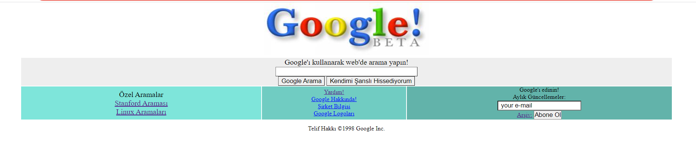

# Kodluyoruz Front-End Css-Ödev-2
Kodluyoruz Programının bize verdiği son ödev.
# *Google Ana Sayfası Tasarlamak* 



Clone ederek index.html'i inceleyebilirsiniz


## Usage


Projeyi klonladıktan sonra Visual Studio Code programında açınız.
Linux için:


```
cd kodluyoruzilkrepo

code . 

```
